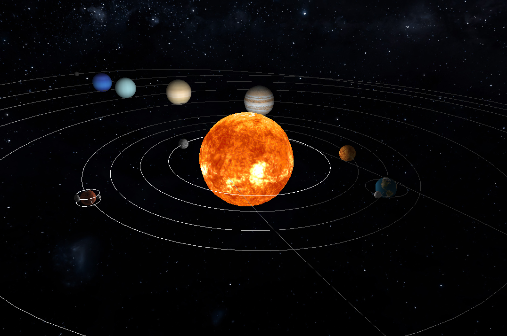

# TP-CG

A small C++/OpenGL graphics engine developed for a university Computer Graphics course.

The project loads XML scene descriptions, renders generated 3D models, and includes several coursework features such as transformations, textures, lighting, Catmull-Rom animation paths, Bezier patch models, debug controls, and frustum culling.

This repository is kept close to the original university project. The goal of the current cleanup is to make it easier to understand, build, and discuss in an interview without rewriting it as a modern engine.



## Features

- XML scene parser for camera, lights, transformations, groups, models, materials, and textures.
- Primitive generator for planes, boxes, cones, spheres, cylinders, and Bezier patch models.
- OpenGL renderer using VBOs.
- Texture loading through DevIL.
- Lighting support for point, directional, and spot lights.
- Hierarchical scene graph with nested transformations.
- Static and time-based transformations.
- Catmull-Rom animated paths.
- Axis, wireframe, normal, bounding box, and frustum debug views.
- Frustum culling with axis-aligned bounding boxes.
- Dear ImGui debug panel for runtime controls.

## Repository Structure

| Path | Description |
| --- | --- |
| `src/engine` | Rendering engine, XML parser, scene graph, transforms, lights, frustum logic, and ImGui integration. |
| `src/generator` | Command-line model generator for primitives and Bezier patches. |
| `src/shared` | Shared math/model parsing utilities and tinyxml2 implementation. |
| `include` | Project headers and bundled third-party headers. |
| `scenes` | XML scene files used by the engine. |
| `models` | Generated `.3d` model files and some model-related sample XML files. |
| `textures` | Texture assets used by demo scenes. |
| `patches` | Bezier patch source files. |
| `assignment` | Original assignment statement. |
| `assignment_material` | Course-provided reference material and test files. |

## Dependencies

The project uses CMake and depends on:

- C++17 compiler
- OpenGL
- GLUT/freeglut
- GLEW
- DevIL
- CMake 3.5+

On Windows, the CMake file expects a `TOOLKITS_FOLDER` path containing the required GLUT, GLEW, and DevIL folders.

## Build

From the repository root:

```sh
cmake -S . -B build
cmake --build build
```

On Windows, configure the toolkit path:

```sh
cmake -S . -B build -DTOOLKITS_FOLDER="C:/path/to/toolkits"
cmake --build build
```

The build creates two executables:

- `engine`: renders XML scene files.
- `generator`: generates `.3d` model files.

## Run

Run the engine from the build directory so the relative asset paths in the XML scenes resolve correctly:

```sh
cd build
./engine ../scenes/solar_system.xml
```

Other useful scenes are available in `scenes/`, including test scenes and solar-system/frustum examples.

Generator examples:

```sh
./generator sphere 1 20 20 ../models/sphere_1_20_20.3d
./generator box 2 3 ../models/box_2_3.3d
./generator patch ../patches/teapot.patch 10 ../models/teapot_10.3d
```

## Controls

Runtime controls are available through the ImGui settings window.

Keyboard controls:

- `W` / `S`: move the camera angle up/down.
- `A` / `D`: rotate the camera around the scene.
- `Page Up` / `Page Down`: zoom out/in.

Debug controls include:

- axis visibility
- frustum visualization
- bounding boxes
- normals
- wireframe mode
- debug camera mode
- camera focus on selected models

## Suggested Demo

For a portfolio walkthrough, the most useful demo is a solar-system scene because it exercises hierarchical transforms, animation, textures, lighting, and the debug UI.

The screenshot above shows the solar-system scene rendered by the engine. A future frustum-culling/debug-camera screenshot would be a useful addition, but the current image is enough to give GitHub visitors immediate visual context.

## Notes / Limitations

This project was developed as a university Computer Graphics assignment and reflects the constraints and style of that context. It is kept close to its original implementation so the repository represents the work honestly rather than as a modern rewrite.

The engine uses older OpenGL/GLUT-style APIs and has some manual resource management/global state typical of a small coursework renderer. The XML scene format, generated `.3d` model files, and included demo assets are part of the original project workflow.

If I revisited this today, I would likely improve asset path handling, dependency setup, error reporting, and rendering abstractions, but the current version is intended to show the original graphics features: scene parsing, primitive generation, transformations, lighting, textures, animation, debug UI, and frustum culling.

## Third-Party / Course Material

The repository includes bundled third-party code such as Dear ImGui and tinyxml2, as well as original course-provided material and test assets. These are included to preserve the original project context and make the demo scenes easier to understand.
